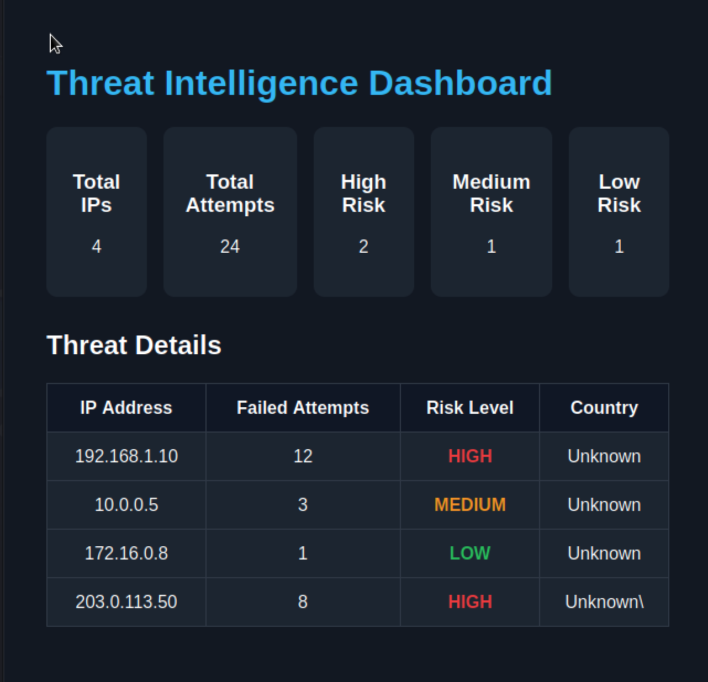

# Threat Intelligence Dashboard

  

## Overview

A cybersecurity dashboard designed to collect, analyze, and visualize threat intelligence data from multiple sources.

## Features

- Real-time threat monitoring
- Malicious IP tracking
- Threat severity classification
- Security analytics and reporting
- Interactive dashboard visualization

## Technologies

- Python
- Streamlit
- REST APIs
- Threat Intelligence Feeds
